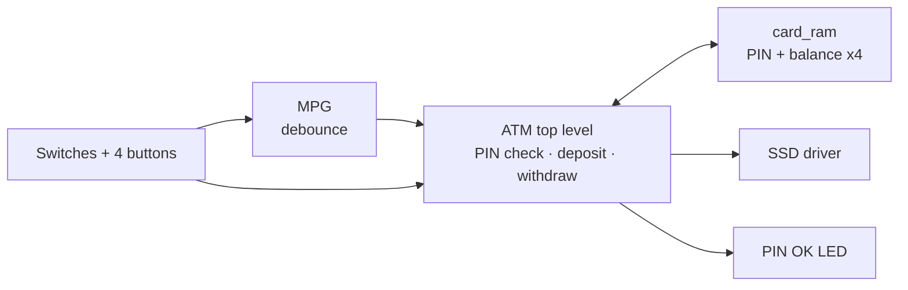

# 🏧 FPGA ATM

An ATM implemented in VHDL for the Basys 3 FPGA board. You pick a card and enter its PIN. Then you can check the balance, deposit, withdraw, or change the PIN, all using the board's switches, buttons and 7-segment display.

## Features

- **4 cards**, each with its own PIN and balance stored in on-chip RAM
- **PIN check** with 4-digit entry. An LED lights up when the PIN is correct.
- **Balance**, **deposit** (€5 to €500 notes) and **withdrawal** (up to €1,000 per transaction)
- **PIN change**, which takes effect immediately
- **Error codes** on the display when a withdrawal is over the limit or the balance is too low
- **Debounced buttons**, so one press is exactly one action

## Architecture

I split the design top-down into a control part and a resource part, then built it bottom-up.

| File | Role |
|---|---|
| [`ATM.vhd`](src/ATM.vhd) | Top level: PIN handling, deposit and withdraw logic, error flags, output mux |
| [`card_ram.vhd`](src/card_ram.vhd) | 4 x 32-bit RAM (PIN in the upper 16 bits, balance in the lower 16) |
| [`MPG.vhd`](src/MPG.vhd) | Button debouncer and single-pulse generator |
| [`SSD_PIN.vhd`](src/SSD_PIN.vhd) | Multiplexed 7-segment display driver |

The block diagrams, the state diagram and the reasoning behind the design are in [`docs/ATM_project.pdf`](docs/ATM_project.pdf).

## 🚀 Running it

**Quick way:** connect a Basys 3, open the Vivado Hardware Manager and program [`bitstream/ATM.bit`](bitstream/ATM.bit).

**From source:**

1. Create a Vivado project for the Basys 3.
2. Add the files in `src/` and set `ATM` as the top module.
3. Add `constraints/Basys-3-Master.xdc`.
4. Run synthesis and implementation, then generate the bitstream.

## 🕹️ Using it

1. Pick a card with the two **card** switches.
2. Enter the PIN. For each of the 4 digits, set the digit on the 4 data switches and press **load**. Then press **confirm_pin**. The LED lights up if the PIN is correct.
3. Set **sel_op** and press **confirm**:

| `sel_op` | Operation | Steps |
|:---:|---|---|
| `00` | Balance | Shown right away |
| `01` | Change PIN | Load 4 new digits, then confirm |
| `10` | Deposit | Set `bill`, press **add** for each note, then confirm |
| `11` | Withdraw | Build the amount digit by digit with `bill` and **add**, then confirm |

The cards come preloaded for testing:

| Card | PIN |
|:---:|:---:|
| `00` | 9736 |
| `01` | 1234 |
| `10` | 1062 |
| `11` | 5406 |

<b>Basys 3 pin mapping</b>

| Signal | Basys 3 control | Pins | Function |
|---|---|---|---|
| `card_nr[1:0]` | SW5, SW4 | V15, W15 | Select card 0 to 3 |
| `sw[3:0]` | SW3 to SW0 | W17, W16, V16, V17 | Digit input |
| `sel_op[1:0]` | SW7, SW6 | W13, W14 | Operation select |
| `bill[2:0]` | SW15 to SW13 | R2, T1, U1 | Banknote or digit-group select |
| `load` | Button | W19 | Load digit |
| `confirm_pin` | Button | U18 | Submit PIN |
| `confirm` | Button | T18 | Confirm operation |
| `add` | Button | U17 | Add note or increment digit |
| `led` | LD0 | U16 | PIN match |
| `an`, `cat` | 7-segment display | | Balance, sums, error codes |

<b>Bill codes</b>

| `bill` | `000` | `001` | `010` | `011` | `100` | `101` | `110` |
|---|:---:|:---:|:---:|:---:|:---:|:---:|:---:|
| Deposit (€) | 5 | 10 | 20 | 50 | 100 | 200 | 500 |

When withdrawing, `001` increments the units digit, `010` the tens and `100` the hundreds.

