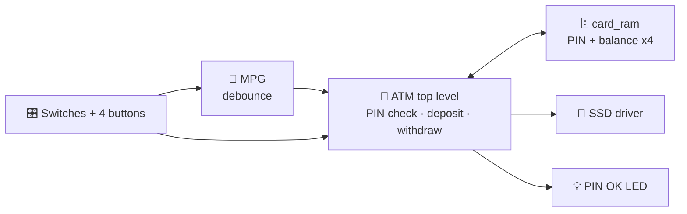

# 🏧 FPGA ATM

<!-- 📸 Add a photo or GIF of the board running here:

 -->

This repository contains the VHDL implementation of an Automated Teller Machine (ATM) designed for the Basys 3 FPGA board. The system simulates real-world ATM operations including secure card authentication, balance checking, deposits, and withdrawals using hardware switches, buttons, and a 7-segment display. 🔧

## ✨ Features

- 💳 **4 card accounts**, each with its own PIN and balance in on-chip RAM
- 🔐 **PIN authentication** with 4-digit entry and an LED that lights up when the PIN matches
- 💶 **Balance check**, **deposit** (€5 to €500 notes) and **withdrawal** (max €1,000 per transaction)
- 🔄 **PIN change**, active immediately
- ⚠️ **Error codes** on the display for over-limit or insufficient-funds withdrawals
- 🧼 **Debounced buttons**, so one press is exactly one action

## 🧠 Architecture

The design was broken down top-down into a control part and a resource part, then built bottom-up.

| File | Role |
|---|---|
| [`ATM.vhd`](src/ATM.vhd) | Top level: PIN handling, deposit and withdraw logic, error flags, output MUX |
| [`card_ram.vhd`](src/card_ram.vhd) | 4 x 32-bit RAM (PIN in the upper 16 bits, balance in the lower 16) |
| [`MPG.vhd`](src/MPG.vhd) | Button debouncer and single-pulse generator |
| [`SSD_PIN.vhd`](src/SSD_PIN.vhd) | Multiplexed 7-segment display driver |

📄 Block diagrams, the state diagram and the design justifications are in [`docs/ATM_project.pdf`](docs/ATM_project.pdf).

## 🚀 Run it

**Quick:** connect a Basys 3, open Vivado Hardware Manager, and program [`bitstream/ATM.bit`](bitstream/ATM.bit).

**From source:** create a Vivado project for the Basys 3, add the files in `src/` (top module `ATM`) and `constraints/Basys-3-Master.xdc`, then run Synthesis, Implementation and Generate Bitstream.

## 🕹️ How to use it

1. Pick a card with the two **card** switches.
2. Enter the PIN: set a digit on the 4 data switches, press **load**, repeat 4 times, then press **confirm_pin**. The LED lights up if it's correct.
3. Set **sel_op** and press **confirm**:

| `sel_op` | Operation | Steps |
|:---:|---|---|
| `00` | 💶 Balance | Shown straight away |
| `01` | 🔄 Change PIN | Load 4 new digits, then confirm |
| `10` | 📥 Deposit | Set `bill`, press **add** per note, then confirm |
| `11` | 📤 Withdraw | Build the amount digit by digit with `bill` and **add**, then confirm |

Demo cards for testing: card `00` has PIN `9736`, card `01` has `1234`, card `10` has `1062`, and card `11` has `5406`. The display shows values in hexadecimal.

📌 <b>Basys 3 pin mapping</b>

| Signal | Basys 3 control | Pins | Function |
|---|---|---|---|
| `card_nr[1:0]` | SW5, SW4 | V15, W15 | Select card 0 to 3 |
| `sw[3:0]` | SW3 to SW0 | W17, W16, V16, V17 | Digit input |
| `sel_op[1:0]` | SW7, SW6 | W13, W14 | Operation select |
| `bill[2:0]` | SW15 to SW13 | R2, T1, U1 | Banknote or digit-group select |
| `load` | Button | W19 | Load digit |
| `confirm_pin` | Button | U18 | Submit PIN |
| `confirm` | Button | T18 | Confirm operation |
| `add` | Button | U17 | Add note or increment digit |
| `led` | LD0 | U16 | PIN match |
| `an`, `cat` | 7-segment display | | Balance, sums, error codes |

💶 <b>Bill codes</b>

| `bill` | `000` | `001` | `010` | `011` | `100` | `101` | `110` |
|---|:---:|:---:|:---:|:---:|:---:|:---:|:---:|
| Deposit (€) | 5 | 10 | 20 | 50 | 100 | 200 | 500 |

When withdrawing, `001` increments the units digit, `010` the tens and `100` the hundreds.

